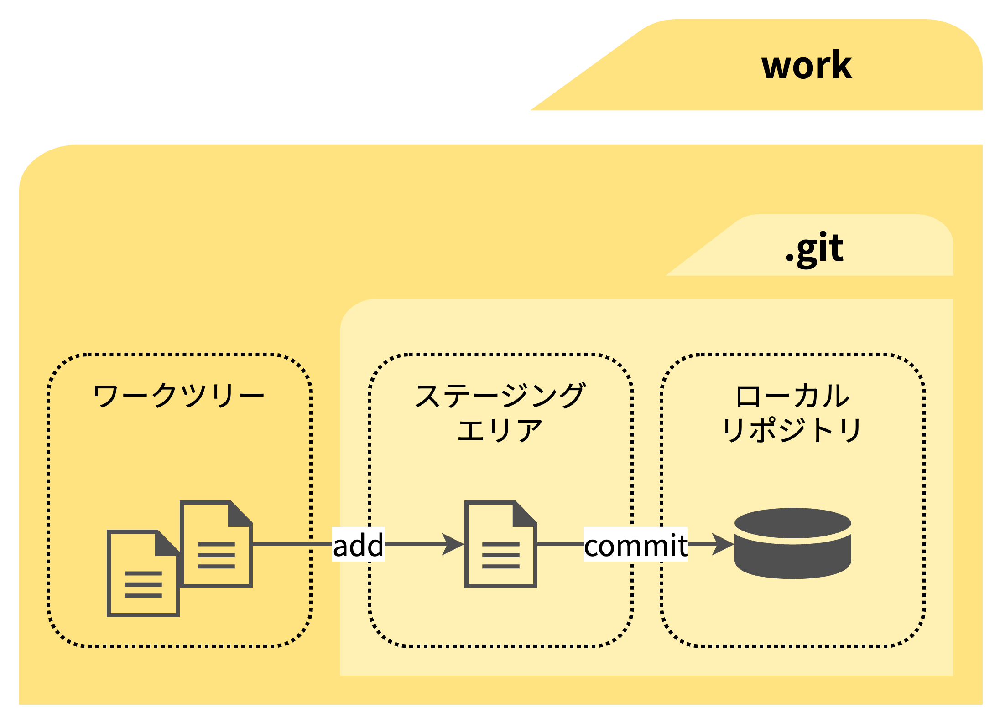

# 0. はじめに

## Gitとは？
バージョン管理を行うためのシステムのひとつ。導入することで以下２つのメリットが得られる

1. 簡単にバージョン管理を行うことができるようになる
2. 複数人での共同作業、チーム開発がやりやすくなる

## バージョン管理とは？

ファイルを以前の状態に戻せるように、ファイルの変更の履歴を保存・管理しておく仕組みのこと

バージョン管理をせずに、１つのファイルを変更・上書き保存する場合、以下のような問題が発生する

- 以前削除した箇所がやはり必要になったとき、手作業で戻す必要がある
- 間違った変更を加えてしまったときも、編集前の状態に手作業で戻す必要がある
- 手作業で戻すので時間がかかる上、正しく復元できない場合もある

## Gitの全体像

変更を加えたファイルが以下の順番で移動していく

ワークツリー → ステージングエリア → ローカルリポジトリ

- ワークツリー: Gitの管理下に置かれた作業ディレクトリのこと
- ステージングエリア: ローカルリポジトリにコミットされる前に、一旦ファイルが配置される領域のこと
- リポジトリ: ステージングエリアのスナップショットを記録する領域のこと
