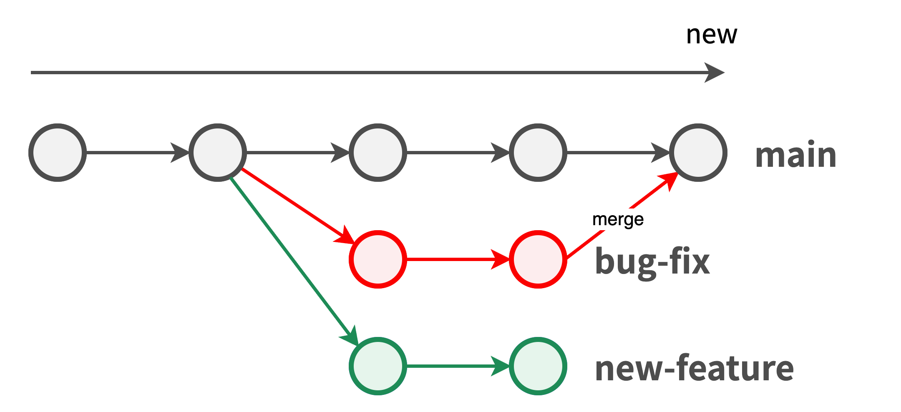

# 2. ブランチ・マージ編

## ブランチとは？
ブランチとは、枝分かれした一連のコミットの履歴のこと。

ソフトウェア開発では並行して作業を行うことが多い。他の作業に影響を受けない・与えない仕組みが必要になる。そのために用いるのがブランチ

開発の目的ごとにブランチを分けることで、それぞれ独立して開発が可能になるのでチーム開発がやりやすくなる。例えば、

1. リリース版のブランチ
2. バグ修正のブランチ
3. 機能追加のブランチ

## メインブランチとは？
Gitリポジトリを作成したときに自動的に作成されるブランチ。

## マージとは？
2つのブランチを１つに統合すること。ブランチはマージすることによって、 それぞれの最新コミットの内容を１つにまとめることができる。 
（より正確に言うと、 ２つのブランチそれぞれの最新コミットの内容を統合する新しいコミットを現在のブランチに作る）
例えば、新機能追加のブランチでの開発が完成し、正しく動作するようになったら、 機能追加のブランチとリリース版のブランチをマージして統合する

## コマンド操作
- 既存のブランチの一覧を表示する
	- Git Bash: `git branch`
	- このコマンドの出力では、 HEADがあるブランチの横に「`*`」マークがついている
- ブランチを新規作成する
	- Git Bash: `git branch new-feature`
- mainブランチから作成した「new-feature」ブランチに切り替える
	- Git Bash: `git checkout new-feature`
- 「bug-fix」というブランチを新規作成した上で、 masterブランチからこのブランチに切り替える
	- Git Bash: `git checkout -b bug-fix`
- 追加、修正を行う
- 「bug-fix」ブランチから「main」ブランチに切り替える
	- Git Bash: `git checkout main`
- 今作業をしている「main」ブランチと、「bug-fix」ブランチをマージする
	- Git Bash: `git merge bug-fix`
	- 変更箇所が重複していない場合は、 「git merge」によって自動でマージが行われるが、 重複している場合はコンフリクトが発生する
	- コンフリクトが発生したらワークツリーを手動で修正した上で「git add」と「git commit」を行う
- 「bug-fix」ブランチを削除する
	- Git Bash: `git branch -d bug-fix`
	- 最新コミットがマージされていないブランチを強制的に削除するには、 「-d」オプションの代わりに、「-D」オプションを付けて以下のように実行する
	- Git Bash: `git branch -D new-feature`

