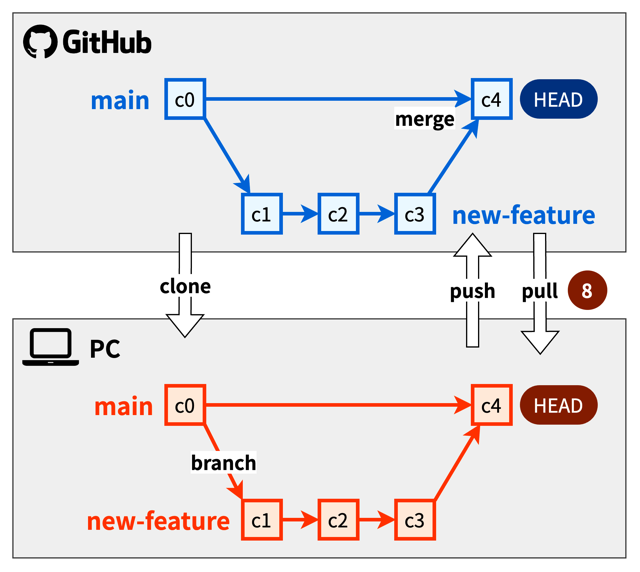

# 3. チーム開発実践編

## ローカルリポジトリとリモートリポジトリ
- **ローカルリポジトリ:** ユーザーが一人で利用するリポジトリ。手元のマシンそれぞれに配置する。ユーザーごとに用意する
- **リモートリポジトリ:** 複数人で共有するリポジトリ。GitHubなど専用のサーバーに配置する。プロジェクトごとに用意する

## GitHubとは？
Gitリポジトリをインターネット上に配置できる、ホスティングサービスのこと。

## clone
リモートリポジトリを手元のマシンにコピーすること。
指定したリモートリポジトリをローカルリポジトリとしてコピーできる。コピー元のリモートリポジトリを追跡するように自動で設定される
- コマンド: `$ git clone https://github.com/username/example.git`

## push
ローカルリポジトリのブランチのコミット履歴をリモートリポジトリに反映すること。
- コマンド: `$ git push origin <branch>`

「origin」はリモートリポジトリのデフォルトの名前

## pull
リモートリポジトリのブランチのコミット履歴をローカルリポジトリに反映すること
- コマンド: `$ git pull origin <branch>`

## 基本ワークフロー
1. **【管理者】** GitHubでリモートリポジトリ「git-practice」を作成

2. **【開発メンバー】** リモートリポジトリをコピーして、ローカルリポジトリを作成する
   - Git Bash: `git clone https://github.com/<username>/git-practice.git`

---
3. **【開発メンバー】** ローカルリポジトリでブランチ「new-feature」を作成し、作成したブランチに切り替える
   - Git Bash: `git checkout -b new-feature`

4. **【開発メンバー】** ファイルを編集し、作成したブランチにコミットする
   - Git Bash: `git add sample.md` → `git commit -m "Message"`
   - VS Code: +ボタン → Commitボタン

---
5. **【開発メンバー】** ローカルリポジトリの内容をリモートリポジトリに反映する
   - Git Bash: `git push origin new-feature`

6. **【開発メンバー】** GitHubで、Pull Requestを作成する
   - [Pull requests] > [New pull request]
   - From branch: new-feature
   - [Create pull request]
   - タイトル、本文を入力 > [Create pull request]

---
7. **【管理者】** GitHubで、Pull Requestの内容を確認し、OKならばマージする
    - [Mearge pull request] > [Confirm mearge]

---
8. **【開発メンバー】** リモートリポジトリの内容をローカルリポジトリに反映する
   - Git Bash: `git checkout main` → `git pull origin main`

---
9. **【開発メンバー】** 不要になったブランチを削除する
   - Git Bash: `git branch -d new-feature`
